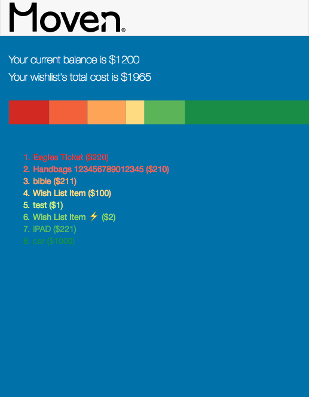
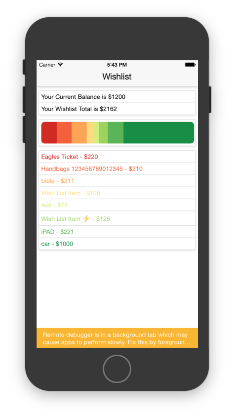

# vanilla-js wishlist

If you have Python installed, clone and navigate into the wishlist-d3-backbone/d3WishlistNative directory, then run the following:

`python3 -m http.server`

Finally, navigate to http://localhost:8000.

React Native implementation coming soon.

# react-native wishlist

